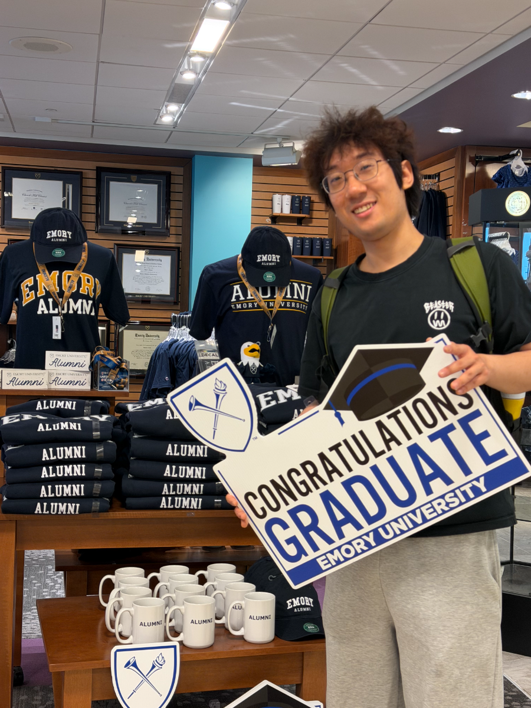

<section class="hero">

Portfolio · 2026

# Hello! I'm <em>Zhengyi Ou</em>

Biostatistics graduate student at Emory turning clinical, EHR, and trial data into clear, decision-ready evidence. I work in R, SAS, Python, and SQL — from raw data through reproducible pipelines to publication-ready output.

ProgramMSPH Biostatistics

InstitutionEmory University, '26

Looking forData Analyst roles

Atlanta, GA · 2026

</section>

<section class="section">

// 01<h2 class="section-title">Toolkit</h2>

Day-to-day stack. The languages and tools I reach for when a question lands on my desk.

LANGR
LANGSAS
LANGPython
LANGSQL
STATSMMRM / LME
STATSSurvival
STATSGLM
STATSCausal Inference
TRIALSSAP Development
TRIALSICH E9(R1)
TRIALSTLF Generation
TRIALSPASS
TOOLSGit
TOOLSggplot2
TOOLSlme4
TOOLSClaude Code

</section>

<section class="section">

// 02<h2 class="section-title">Right now</h2>

A snapshot of what's currently on my desk.

Working on
Co-authored manuscript on a 2,648-patient orthobiologic cohort — currently under peer review.

Wrapping up
MSPH capstone on post-stroke sleep outcomes using wearable data from 50 patients.

Open to
Full-time Data Analyst / Biostatistician roles starting summer 2026.

</section>

<footer class="footer">

© 2026 Zhengyi Ou — Built with R Markdown + GitHub Pages
Last updated · Apr 2026

</footer>
